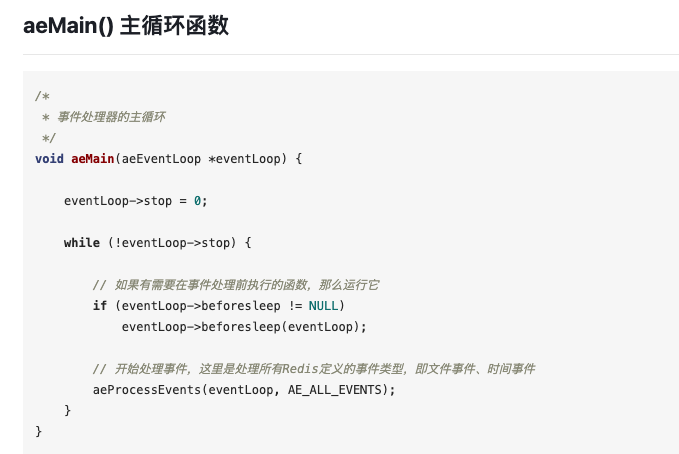

# redis 备忘录

- redis部署类型 
redis 5.0 单机架构/集群架构 
redis 6.0 单机架构/集群架构 

- redis是什么？ 
c语言开发的开源的NoSQL内存数据库，可以用作数据库、缓存和消息中间件 
单元测试使用tcl写的，tcl和shell语言一样是一种脚本语言，执行器为tclsh 

- redis中重要的数据结构 
  - redisServer: 一个超级巨大的结构体，主要的字段譬如：
    - db数组：存放数据的地方，类型redisDb
    - commands：命令表
    - clients：存放连接到服务器的客户端的链表
    - master：特殊的client，类型是client，对于当前redisServer来说是client，实际架构上：当前redisServer是slave，这个master对应的client是master
  - client（原先叫redisClient）：定义了来自客户端的链接，类似于http.Request，但是用的是更底层的描述方式：fd、querybuf、replybuf、args等

- redis的启动 
  - 和大多数业务服务启动类似，先读取配置，然后listen&serve，实际调用aeMain函数
  - serve中做了什么事？ __启动监听新链接的事件循环__
    - 这个和大多数业务服务器也是一样的，譬如golang标准库http-server的实现，也是listen之后，开始阻塞式的accept链接，有新链接就起一个协程异步去处理，和这里的事件很类似
    - 事件处理模型：
    - 
    - 网络监听模型：
- redis的事件驱动模型及IO多路复用是怎么落地实现的呢？ 
  - 创建eventLoop传递一个参数，setSize，即可以坚挺的网络事件fd的个数，如果fd超过了这个限制，那当前eventLoop上就不能再注册事件了，而redis启动的时候，就是在main函数中调用aeMain函数，开始执行一个eventLoop 
  - linux内核会给每个进程维护一个文件描述符表，fd012分别代表标准输入、输出、和错误输出，每次打开新的fd必须使用当前进程中最小可用的fd
  - aeMain之中又做了啥？
    - 如图：
    - 这里是通过一个住循环轮训处理所有事件，也就是通常说redis是单线程的原因
      - beforeSleep，先于aeProcessEvent执行
        - 通常执行事件处理的时候会被阻塞，可能是网络I/O、文件I/O等，阻塞时起时就是对应进程要sleep了，有些事情需要在sleep前要做的，可以做，也是循环调用的，每次调用aeProcessEvent前都会调用，循环的频率
      - aeProcessEvent：处理所有事件：文件事件和时间事件
        - 文件事件：select/epoll等网络事件
        - 时间事件：持久话、清理过期数据等
  
- redis支持的数据类型？ 
redis是k-v数据库，所支持的数据类型指value的数据类型，常用的有：string、list、hashtable、set、sorted-set等 
redis托管在[github](https://github.com/redis/redis/)上，readme对redis的内部结构做了简单说明 
  - redis 对应是通过redisObject描述的，如图：
  - string是二进制安全的，即不带编码格式的纯二进制，可以存对象的序列化串甚至可以存图片，最大可存512M
    - t_string.c实现定义和处理string类型的kv操作
    - 一个strObj维护一个字节数组，存放实际内容
  - hashtable：哈希表实现：hget/hset/hgetall等
  - list：双向链表：lpush/lpop/rpush/rpop/lrang等
    - 可以当成消息队列用
  - set：哈希表实现：sadd/spop等
  - zset：哈希表+跳表实现，跳表存放的是所有成员，带顺序；哈希表存放成员到sore的映射
  - 不同数据类型的应用场景：

- redis持久化？是否可以利用redis做持久话存储？ 
  - redis利用fork创建一个用户持久话的子进程
  - aof.c和rdb.c实现了redis的red和aof持久化
  - RDB是Redis用来进行持久化的一种方式，是把当前内存中的数据集快照写入磁盘，也就是 Snapshot 快照（数据库中所有键值对数据）。RDB 有两种触发方式，分别是自动触发（redis.conf中配置）和手动触发（save/bgsave）。
  - RDB 在恢复大数据集时的速度比 AOF 的恢复速度要快
  - AOF 做持久化，每一个写命令都通过 write 函数追加到 appendonly.aof 中，使用 AOF 的优点是会让 Redis 变得非常耐久。可以设置不同的 Fsync 策略，AOF的默认策略是每秒钟 Fsync 一次，在这种配置下，就算发生故障停机，也最多丢失一秒钟的数据
  - Redis 支持同时开启 RDB 和 AOF，系统重启后，Redis 会优先使用 AOF 来恢复数据，这样丢失的数据会最少。

- redis分布式锁的实现？ 

- redis作为消息中间件，如何进行消息的订阅与发布？怎么实现的？ 

- redis的主从同步是在redis代码上实现的，replication.c完成主从同步的工作 
- 哨兵、master、slave

- 缓存雪崩？穿透？击穿？
  - 雪崩：Cache avalanche [ˈævəˌlɑːntʃ]（缓存大面积失效）
    - 过期时间加随机数
    - 热点数据分布到不同集群
    - 热点数据永不过期（不设置过期时间），和数据库同步更新
  - 穿透：Cache penetration [.penə'treɪʃ(ə)n]（指缓存和数据库中都没有的数据，但却产生了数据库的查询）
    - 增加有效性校验（用户鉴权、参数校验）
  - 击穿：cache breakdown（热点数据过期瞬间，大量请求因为无缓存打到db，像一个桶上被凿开了一个洞），雪崩是一个面，击穿是一个点
    - 热点数据永不过期，保持和数据的一致性更新
    - 或者加上互斥锁（只允许一个请求去db中拿）

- redis单线程为什么这么快？
  - 完全基于内存
  - 数据结构简单
  - 单线程不用频发切换上下文，也不用处理多线程下的各种锁问题
  - I/O多路复用

- redis集群模式？
  - 主从复制
  - 哨兵模式
  - redis cluster模式
    - Redis Cluster 采用数据分片机制，定义了 16384个 Slot槽位，集群中的每个Redis 实例负责维护一部分槽以及槽所映射的键值数据。
    - 客户端可以连接集群中任意一个Redis 实例，发送读写命令，如果当前Redis 实例收到不是自己负责的Slot的请求时，会将该slot所在的正确的Redis 实例地址返回给客户端。
    - 客户端收到后，自动将原请求重新发到这个新地址，自动操作，外部透明。